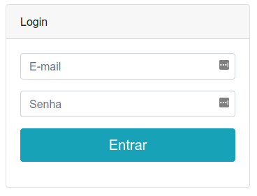
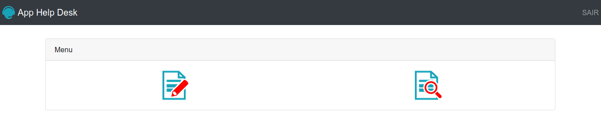
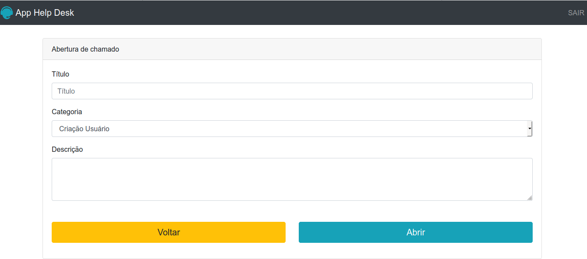
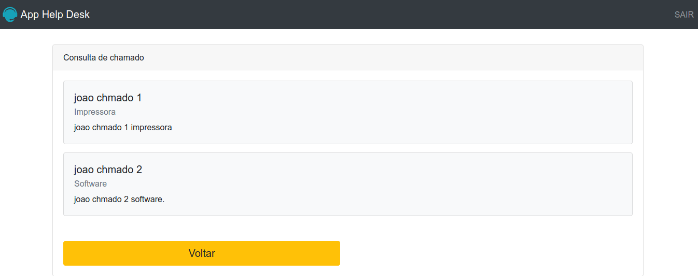

# app_help_desk
O app_help_desk é um projeto baseado em um sistema onde se pode abrir chamados e consulta-los. Temos dois perfis de usuários, Administrador que possuem a permissão de acesso a todos os chamados. Já os de perfil Usuário só possuem a permissão de enxergar seus próprios chamados. 
Por se tratar de um app para aprendizado, alguns conceitos mais avançados como persistência de dados em um BD e orientação a objetos, não foram inclusos.
Alguns arquivos importantes como o de validação de login está incluso junto da aplicação no diretório público, mas o ideal é que os arquivos de vital importância como por exemplo os de regra de negócios fique fora da pasta publica, para que possa estar atrás do firewall do sistema operacional.

##Tela de login

##Tela principal

##Tela de criação de chamados

##Tela de consulta de chamados

